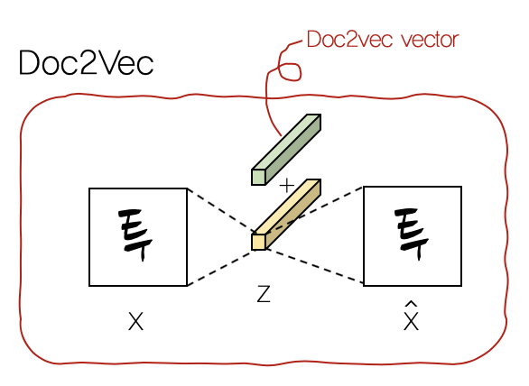
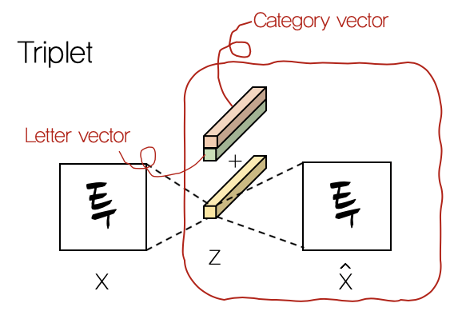

# FontStyler
원하는 스타일의 폰트로 글씨를 바꿔주는 인공지능 폰트 스타일러 <br/>
(~~업데이트 중입니다~~)

## # Introduction


## # Data
- [네이버 한글날 손글씨 공모전](https://clova.ai/handwriting/list.html)에서 공개된 109개의 폰트 중 107개
- 상용 한글 2350자

총 107 * 2350 = 251,450개의 데이터 사용 <br/>
CROP - RESIZE - PADDING 방식으로 전처리


## # Embedding

### 1. Doc2Vec
"네이버 한글날 손글씨 공모전" 각 폰트의 소갯말 + 서사적인 노래 가사 3만곡 <br/>
&nbsp;&nbsp;&nbsp;&nbsp; → 추후 이용자가 입력할 문장에 대응

### 2. Triplet Network
1\) 같은 폰트끼리 뭉치는 네트워크 <br/>
2\) 같은 글자끼리 뭉치는 네트워크 <br/>
&nbsp;&nbsp;&nbsp; → 각각을 학습하여 임베딩 벡터로 사용


## # Model
### Model using Doc2Vec


### Model using Triplet Network


## # Result


## # Code
```
src/
└── data/
    ├── collection/
    └── common/
        ├── __init__.py
        ├── dataset.py
        └── utils.py
    └── dataset/
└── models/
    ├── __init__.py
    ├── function.py
    ├── layers.py
    ├── loss.py 
    └── model.py
```

### Requirements
```
pip3 install -r requirement.txt
```


## # References
- [DEVIEW 2019 이바도님 - 나 대신 손글씨 써주는 AI 만들기 (성공적인 Side Project)](https://deview.kr/2019/schedule/294)
- [zi2zi](https://github.com/kaonashi-tyc) by [kaonashi-tyc](https://github.com/kaonashi-tyc/zi2zi)
- [Handwriting Styler](https://github.com/jeina7/Handwriting_styler) by [jeina7](https://github.com/jeina7)
